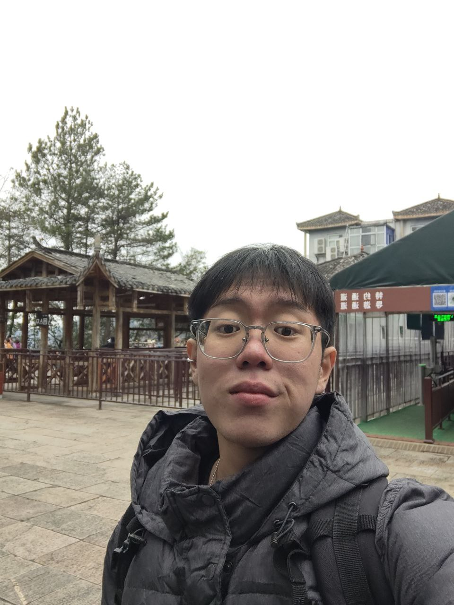
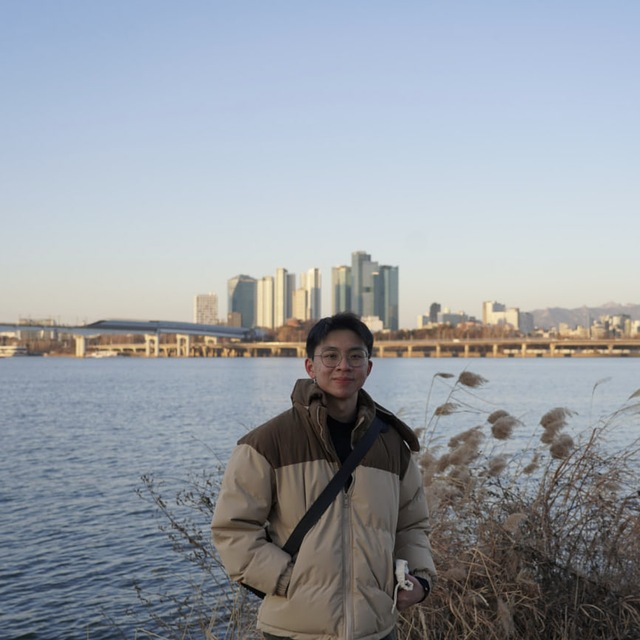

# About Us

We are a team based in the [School of Computing, National University of Singapore](http://www.comp.nus.edu.sg).

You can reach us at the email `seer[at]comp.nus.edu.sg`

## Project team

### Keith Kng

[[github](https://github.com/keithkng)]

* Role: Team Lead
* Responsibilities: Responsible for overall project coordination.

### Darren Ong Yan En

[[github](https://github.com/darrenori)]

* Role: Integration
* Responsibilities: Version the code, maintain the code repository, and integrate various parts of the software into a whole.

### Johnny Doe

[[github](http://github.com/johndoe)] [[portfolio](team/johndoe.md)]

* Role: Developer
* Responsibilities: Data

### Jean Doe

[[github](http://github.com/johndoe)]
[[portfolio](team/johndoe.md)]

* Role: Developer
* Responsibilities: Dev Ops + Threading

### James Doe

[[github](http://github.com/johndoe)]
[[portfolio](team/johndoe.md)]

* Role: Developer
* Responsibilities: UI
