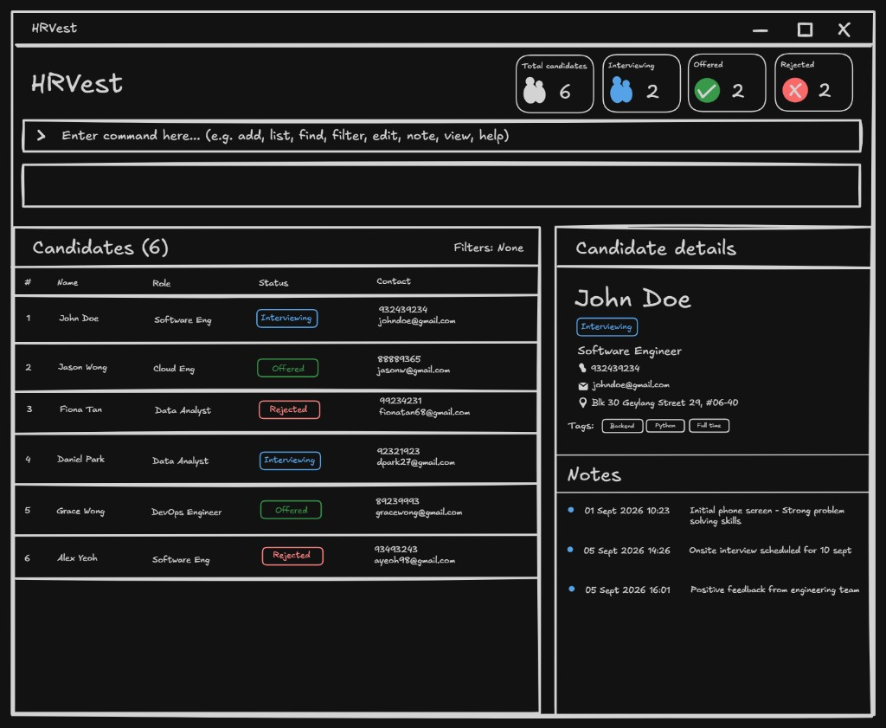

# HRvest User Guide

HRvest is a **desktop address book that helps hiring managers at startups track candidates through the hiring pipeline with less administrative work**. While it has a GUI (Graphical User Interface), most interactions are short typed commands in a CLI (Command Line Interface), so if you type fast, you can work faster than in a mouse-driven applicant tracking system.

<!-- * Table of Contents -->
<page-nav-print />

--------------------------------------------------------------------------------------------------------------------

## Quick start

1. Ensure that Java `25` or later is installed on your computer. 
   **Mac users:** Ensure you have the precise JDK version prescribed [here](https://se-education.org/guides/tutorials/javaInstallationMac.html).

1. Download the latest `.jar` file from [here](https://github.com/AY2627S1-CS2103-F10-1/tp/releases).

1. Copy the file to the folder you want to use as the _home folder_ for HRvest.

1. Open a terminal, `cd` to the folder containing the JAR file, and run `java -jar addressbook.jar`. 
   A GUI similar to the one below should appear in a few seconds. Note how the app contains some sample data. 
   

1. Type a command in the command box and press Enter to execute it. For example, type **`help`** and press Enter to open the help window. 
   Some example commands you can try:

   * `list` : Lists all candidates.

   * `add n/John Doe p/98765432 e/johnd@example.com a/John street, block 123, #01-01` : Adds a candidate named `John Doe` to HRvest.

   * `delete 3` : Deletes the 3rd candidate shown in the current list.

   * `clear` : Deletes all candidates.

   * `exit` : Exits the app.

1. Refer to the [Features](#features) section below for details of each command.

--------------------------------------------------------------------------------------------------------------------

## Features

<box type="info" seamless>

**Notes about the command format:** 

* Words in `UPPER_CASE` are the parameters to be supplied by the user. 
  For example, in `add n/NAME`, replace `NAME` with a value such as `John Doe`.

* Items in square brackets are optional. 
  For example, `n/NAME [t/TAG]` can be used as `n/John Doe t/friend` or as `n/John Doe`.

* Items followed by `...` can appear zero or more times. 
  For example, `[t/TAG]... ` may be omitted, or written as `t/friend` or `t/friend t/family`.

* Parameters can be in any order. 
  For example, if the command specifies `n/NAME p/PHONE_NUMBER`, `p/PHONE_NUMBER n/NAME` is also acceptable.

* Extraneous parameters for commands that take no parameters, such as `help`, `list`, `exit`, and `clear`, are ignored. 
  For example, `help 123` is interpreted as `help`.

* If you are using a PDF version of this document, be careful when copying and pasting commands that span multiple lines as space characters surrounding line-breaks may be omitted when copied over to the application.
</box>

### Viewing help: `help`

Shows a message explaining how to access the help page.

Format: `help`

### Adding a person: `add`

Adds a person to the address book.

Format: `add n/NAME p/PHONE_NUMBER e/EMAIL a/ADDRESS [t/TAG]... `

<box type="tip" seamless>

**Tip:** A person can have any number of tags, including zero.
</box>

Examples:
* `add n/John Doe p/98765432 e/johnd@example.com a/John street, block 123, #01-01`
* `add n/Betsy Crowe t/friend e/betsycrowe@example.com a/Newgate Prison p/1234567 t/criminal`

### Listing all persons: `list`

Shows a list of all persons in the address book.

Format: `list`

### Editing a person: `edit`

Edits an existing person in the address book.

Format: `edit INDEX [n/NAME] [p/PHONE] [e/EMAIL] [a/ADDRESS] [t/TAG]... `

* Edits the person at the specified `INDEX`. The index refers to the index number shown in the displayed person list. The index **must be a positive integer** 1, 2, 3, ...
* At least one of the optional fields must be provided.
* Existing values will be updated to the input values.
* When editing tags, all of the person's existing tags are removed; adding tags is not cumulative.
* To remove all of a person's tags, enter `t/` without a tag after it.

Examples:
*  `edit 1 p/91234567 e/johndoe@example.com` Edits the phone number and email address of the 1st person to be `91234567` and `johndoe@example.com` respectively.
*  `edit 2 n/Betsy Crower t/` Edits the name of the 2nd person to be `Betsy Crower` and clears all existing tags.

### Adding or replacing a candidate's note: `note`

Records interview feedback or follow-up context for a candidate. Each candidate has **one note**; running this command again **replaces the existing note entirely**.

Format: `note INDEX no/NOTE_TEXT`

* `INDEX` is required and must be a positive integer within the currently displayed list. Use the displayed index after a search, rather than the candidate's position in the full list.
* `NOTE_TEXT` is required, must be non-blank, and can contain at most **500 characters after trimming**. Leading and trailing whitespace is removed; internal spacing, capitalization, punctuation, and line breaks are preserved.
* The `note` command word and `no/` prefix are case-insensitive. Use `no/` once; whitespace followed by this prefix starts another note value and is rejected as a repeated prefix. Other prefix-like text, such as `n/`, remains part of the note.
* On success, HRvest saves the note immediately, resets the list to show all candidates, and displays `Updated note for <NAME>: <NOTE_TEXT>`.
* A pinned sticky note icon beside the candidate's name indicates a note exists. Its tooltip reads `Note available`; the card does not display the note text. Viewing full notes using the planned `expand` command is a separate feature.
* Entering the same note again still succeeds normally. Editing contact details, tags, or recruitment status keeps the note. Updating a note keeps the candidate's recruitment status. Notes do not affect duplicate detection.
* Invalid input leaves the existing note, displayed list, and saved data unchanged. If saving fails, HRvest shows a storage error and keeps the existing note and displayed list.

Examples:

* `note 2 no/Strong on system design, weak on SQL`
* `note 2 no/Passed round 2, schedule final interview` replaces the previous note on candidate 2.
* `find Betsy` followed by `note 1 no/Follow up next week` updates the first displayed search result, then shows all candidates.

| Problem | Message |
|---------|---------|
| Missing `no/` | `The note prefix no/ is required.` followed by the command usage |
| Missing index, or an index that is not a positive integer | `Index must be a positive integer.` followed by the command usage |
| Index outside the displayed list | `The candidate index provided is invalid.` |
| Blank note | `Note cannot be blank.` |
| More than 500 characters after trimming | `Note cannot exceed 500 characters.` |
| Repeated `no/` prefix | `Multiple values specified for the following single-valued field(s): no/` |

<box type="warning" seamless>

**Overwriting loses the previous note.** Include earlier information in the replacement if you want to keep it. The MVP has no note history or undo, and does not support clearing a note.
</box>

### Updating a candidate's recruitment status: `status`

Updates the candidate at the given index in the currently displayed list.

Format: `status INDEX s/STATUS`

* `INDEX` is a positive, 1-based index in the displayed list.
* Valid statuses are `Applied`, `Shortlisted`, `Interviewing`, `Offered`, `Accepted`, `Rejected`, and `Withdrawn`, regardless of letter case.
* New candidates start with `Applied`. Status is saved immediately, shown on the candidate card, and does not affect duplicate checking.
* After an update, the full candidate list is shown. The message is `Updated status of NAME: OLD_STATUS -> NEW_STATUS`.
* A missing `s/` or non-integer index gives `Invalid command format!`; an index outside the displayed list gives `The candidate index provided is invalid.`
* An unknown status gives `Status must be one of: Applied, Shortlisted, Interviewing, Offered, Accepted, Rejected, Withdrawn`; repeated `s/` gives `Multiple values specified for the following single-valued field(s): s/`.

Examples:

* `status 3 s/Interviewing`
* `status 1 s/Accepted`

### Locating persons by name: `find`

Finds persons whose names contain any of the given keywords.

Format: `find KEYWORD [MORE_KEYWORDS]`

* The search is case-insensitive; for example, `hans` matches `Hans`.
* Keyword order does not matter; for example, `Hans Bo` matches `Bo Hans`.
* The search considers only names.
* Only full words match; for example, `Han` does not match `Hans`.
* Persons matching at least one keyword are returned (an `OR` search); for example, `Hans Bo` returns `Hans Gruber` and `Bo Yang`.

Examples:
* `find John` returns `john` and `John Doe`
* `find alex david` returns `Alex Yeoh`, `David Li` 
  

### Deleting a person: `delete`

Deletes the specified person from the address book.

Format: `delete INDEX`

* Deletes the person at the specified `INDEX`.
* The index refers to the index number shown in the displayed person list.
* The index **must be a positive integer** 1, 2, 3, ...

Examples:
* `list` followed by `delete 2` deletes the 2nd person in the address book.
* `find Betsy` followed by `delete 1` deletes the 1st person in the results of the `find` command.

### Clearing all entries: `clear`

Clears all entries from the address book.

Format: `clear`

### Exiting the program: `exit`

Exits the program.

Format: `exit`

### Saving the data

AddressBook automatically saves data after every command. You do not need to save manually.

Saving writes a temporary file before atomically replacing the data file. If saving fails, HRvest shows an error and keeps the previous saved file. The data folder must support atomic file replacement. On filesystems that support file ACLs (access control lists) or POSIX permissions, saving preserves those settings on the existing data file; a failure to read or apply them causes the save to fail. If the data file is a symbolic link, saving updates its existing target and keeps the link. Saving fails if the link's target does not exist, leaving the link unchanged.

The Windows account running HRvest must have permission to write in the data folder and access the existing data file. If those permissions are insufficient, HRvest reports a save error and keeps the existing access restrictions.

A crash or power loss can leave temporary files named `HRvest-<random>.tmp` beside the data file. After closing all HRvest instances, you can delete these leftover `.tmp` files. Keep the saved JSON data file (normally `data/addressbook.json`) and any symbolic-link target; these are not temporary files.

### Editing the data file

AddressBook data is saved automatically as a JSON file `[JAR file location]/data/addressbook.json`. Advanced users are welcome to update data directly by editing that data file.

<box type="warning" seamless>

**Caution:**
If your changes make the data file invalid, AddressBook starts with an empty address book at the next run. The invalid file remains on disk until you run a command (AddressBook saves after every command). Still, we recommend backing up the file before editing it. 
Furthermore, certain edits can cause the AddressBook to behave in unexpected ways (e.g., if a value entered is outside of the acceptable range). Therefore, edit the data file only if you are confident that you can update it correctly.
</box>

### Archiving data files `[coming in v2.0]`

_Details coming soon ..._

--------------------------------------------------------------------------------------------------------------------

## FAQ

**Q**: How do I transfer my data to another computer? 
**A**: Install the app on the other computer and overwrite the data file it creates with the data file from your previous AddressBook home folder.

--------------------------------------------------------------------------------------------------------------------

## Known issues

1. **When using multiple screens**, if you move the application to a secondary screen, and later switch to using only the primary screen, the GUI will open off-screen. The remedy is to delete the `preferences.json` file created by the application before running the application again.
2. **If you minimize the Help Window** and then run the `help` command (or use the `Help` menu, or the keyboard shortcut `F1`) again, the original Help Window will remain minimized, and no new Help Window will appear. The remedy is to manually restore the minimized Help Window.

--------------------------------------------------------------------------------------------------------------------

## Command summary

Action     | Format, Examples
-----------|----------------------------------------------------------------------------------------------------------------------------------------------------------------------
**Add**    | `add n/NAME p/PHONE_NUMBER e/EMAIL a/ADDRESS [t/TAG]... `   e.g., `add n/James Ho p/22224444 e/jamesho@example.com a/123, Clementi Rd, 1234665 t/friend t/colleague`
**Clear**  | `clear`
**Delete** | `delete INDEX`  e.g., `delete 3`
**Edit**   | `edit INDEX [n/NAME] [p/PHONE_NUMBER] [e/EMAIL] [a/ADDRESS] [t/TAG]... `  e.g.,`edit 2 n/James Lee e/jameslee@example.com`
**Find**   | `find KEYWORD [MORE_KEYWORDS]`  e.g., `find James Jake`
**List**   | `list`
**Note**   | `note INDEX no/NOTE_TEXT`  e.g., `note 2 no/Passed round 2, schedule final interview`
**Status** | `status INDEX s/STATUS`  e.g., `status 3 s/Interviewing`
**Help**   | `help`
